# PID control with PSO

## Introduction

In the metallurgical production line, tension fluctuation and different roughness of the strip steel can lead to the edge of the strip not being parallel to the centerline of the unit, which eventually causes the lateral deviation of the strip. In order to prevent this deviation and improve yield, the central position control system (CPC) is used in the strip steel continuous rolling line.

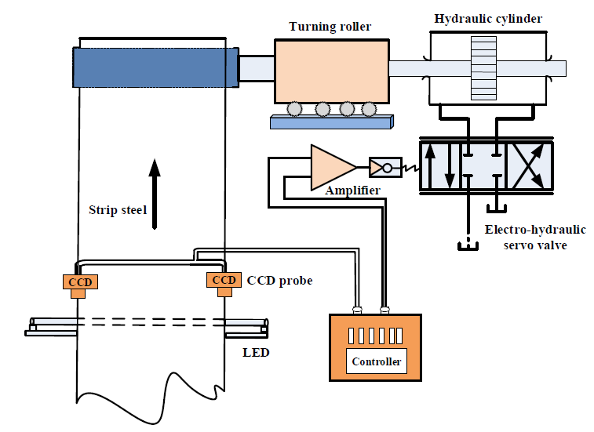

The CPC system consists of three parts – a controller, a sensor, and an actuator. The sensor is a photoelectric CCD detector, and its effect is to detect the difference between the given displacement and the output displacement caused by the turning roller. When the strip edge deviates from the center line, a photoelectric CCD sensor outputs a deviation signal voltage which is amplified and delivered to the controller. It processes the signal and outputs the regulated current of the electro-hydraulic servo valve to control the actuator. This causes the hydraulic cylinder to move the turning roller. Then the turning roller drives the strip to slip until the strip position deviation is eliminated. The electrical signal of the output displacement is continuously fed back to the controller until the difference is zero. Thus, a complete closed loop system is formed.

## Particle Swarm Optimization

We use a PID controller to control a CPC system. Tuning of the PID controller is very important, as unoptimized gains can result in high overshoot, high settling time or even instability. PSO is a popular non-deterministic method for finding the global optimum of a function. It is modelled after the flight patterns of birds. This method uses a set of particles (swarm) that move around in the search space looking for the best solution. Here, we take the search space as $K_p \in [0.015, 0.5], K_i \in [0.0001, 0.15], K_d \in [0.0001, 0.15]$

Each particle adjusts its flight according to its own flying experience as well as the flying experience of other particles. The particle and swarm’s best positions are determined by minimizing the fitness value ofthe objective function. Here, the objective function is the integral time absolute error, $ITAE = \int_0^\infty t \left|e(t)\right| dt \approx \sum_{n=0}^\infty t_n \left|e[nT_s]\right|T_s$

The velocity and position of the kth particle are updated in each iteration as,

$\textbf{v}_k(t + 1) = w\textbf{v}_k(t) + c_1r_1\left(\textbf{P}_{\text{best},k}(t) - \textbf{x}_k(t)\right) + c_1r_1\left(\textbf{G}_{\text{best},k}(t) - \textbf{x}_k(t)\right)$ 
$\textbf{x}_k(t + 1) = \textbf{x}_k(t) + \textbf{v}_k(t + 1)$

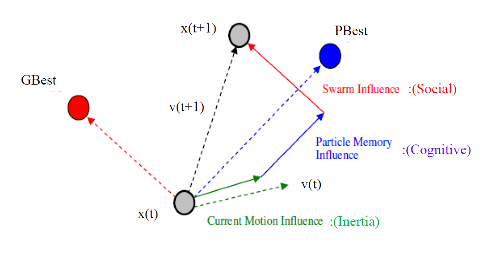

w is the weight factor. It is a measure of how much the particle wants to continue in its previous path. c1 is the cognitive attraction constant. It is a measure of how much the particle is influenced by its own previous best position. c2 is the social attraction constant. It is a measure of how much the particle is influenced by the entire swarm’s best position. r1 and r2 are random numbers between 0 and 1. Lower values of c1 and c2 imply exploration, i.e., particles move freely to undiscovered locations in the search space. Higher values of c1 and c2 imply exploitation, i.e., particles move in a constricted fashion around the previously discovered best positions. Here, the parameters are – no. of variables = 3, Population size = 10, no. of iterations = 20, wmax = 0.9, wmin = 0.2, c1 = c2 = 1.495

## Problems and Remedy

The traditional CPC system normally adopts the PID controller whose control parameters are adjusted by the typical Ziegler-Nichols method. The problem with this method is that it leads to a large overshoot and hysteresis in the output. To deal with this particular issue, Particle Swarm Optimization is used to tune the control parameters in order to improve its performance. But the issue with the PSO algorithm is that it is prone to fall into a local optimum output due to the lack of diversity in the population. This is resolved by using a further new approach named modified particle swarm optimization (MPSO) wherein a genetic crossover algorithm is introduced. Also, the problem of the possibility of particles of MPSO flying away from search space is solved by using a dynamic weight update equation to avoid the problem of local minima. Furthermore, in a typical PID controller there is a lack of elimination error and control accuracy and excessive adjusting time. To resolve these problems, an integral separation PID (IPID) control algorithm is proposed.

Firstly, crossover is introduced. We select a random particle and cross it with its historical best position in order to ensure that diversity is maintained in the subsequent iterations. This helps in avoiding the problem of getting trapped in a local minima and accelerates the speed of convergence.

$\textbf{x}_i(t + 1) = \alpha\textbf{x}_i(t) + (1-\alpha)\textbf{x}_j(t)$ 
$\textbf{x}_j(t + 1) = \alpha\textbf{x}_j(t) + (1-\alpha)\textbf{x}_i(t)$

Secondly, a non-linear weight update equation is introduced. Normally, weight decreases linearly because after each iteration the particle is closer to the optimum value, hence, the particles should have more inertia. Here, we see that this function first decreases, then increases, and then decreases again. The increase in the middle ensures that the particle can escape if it has fallen into a local minima. We take C = 2 and p = 2.

$w(t) = 1 - \left(w_{\text{max}}e^{\frac{-(t-1)}{\text{iter}_\text{max}}}+ \cfrac{1}{2C}w_{\text{min}}\ln(t) - \left|\cfrac{\text{iter}_\text{max}-t}{p\cdot\text{iter}_\text{max}}\right|\right)$

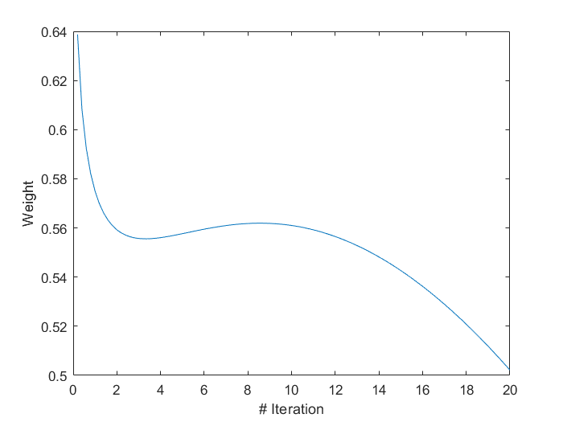

We employ a discrete PID controller so that it can be appropriately modelled on a microcontroller or microprocessor based device.

$u[nT_s] = K_p\left(e[nT_s] + \beta K_i\sum_{j=0}^n e[jT_s] + K_d(e[nT_s]-e[(n-1)T_s])\right)$

Beta factor is 0 if error crosses a certain threshold value, else it is 1. This is done to prevent integral windup, the phenomena where integral action accumulates significantly during rising error, and thus controller output continues to increase even when error is being unwound by offset in another direction. We take the threshold to be 0.1% of maximum error. This configuration for avoiding accumulative error of the overshoot integral is called integral separated PID (IPID).

## Simulink Model

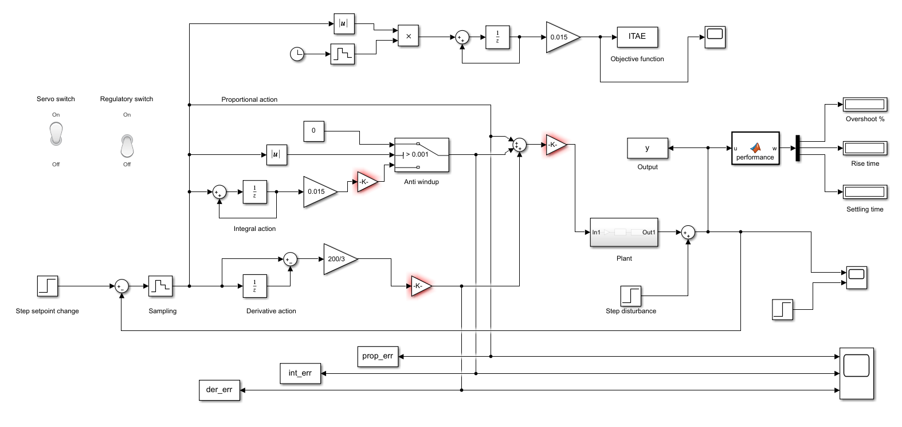

The model is constructed with appropriate Simulink blocks and all workspace variables are stored in data.mat. Sampling is done using the zero order hold element with sampling time 0.015 seconds.

In the digital domain, differentiation and integration is done by taking z-transform. They are, respectively,

$y[n] = x[n]-x[n-1] \implies Y(z) = (1-z^{-1})X(z)$ 
$y[n] = y[n-1] + x[n] \implies Y(z) = \cfrac{z^{-1}}{1-z^{-1}}X(z)$

The plant subsystem is a series cascade of the servo valve transfer function and the hydraulic cylinder transfer function, along with a scale factor corresponding to the sensitivity of the displacement detection sensor. Their corresponding transfer functions are given by,

$G_{sv}(s) = \cfrac{K_{sv}}{\cfrac{s^2}{\omega_{sv}^2} + \cfrac{2\zeta_{sv}s}{\omega_{sv}} + 1}$ 
$G_{h}(s) = \cfrac{\cfrac{1}{A_p}}{s\left(\cfrac{s^2}{\omega_h^2} + \cfrac{2\zeta_h s}{\omega_h} + 1\right)}$

After substituting the variables with their values as known from the process operation, we get

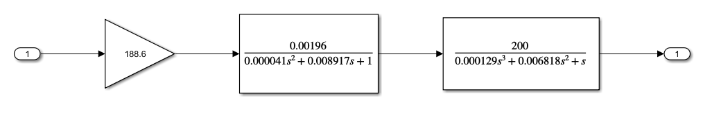

## Simulation Results

Open test.m and run the script. This will simulate the model testsim.slx multiple times and use the PSO algorithm to tune the PID controller. Only after running the above script will the model work. Before that, the gain blocks (initially highlighted in red) will be uninitialized. Click on the scopes to see the figures corresponding to output, errors and ITAE, and view the overshoot, rise time and settling time in the dispay blocks. The toggle switches can toggle between servo response and regulatory response. Only one of them must be on at a time. 

All workspace variables are stored in data.mat in the GUI folder. Run the code in app1.m for an interactive GUI app. Its initial screen is as shown below.

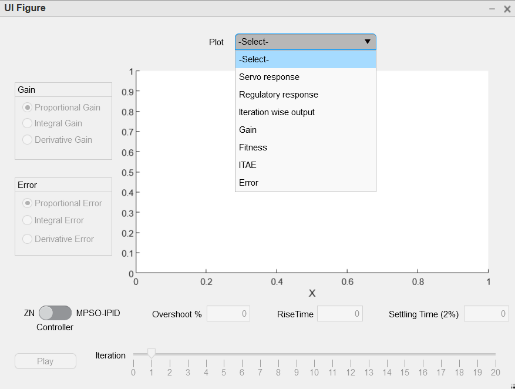

We can plot the relevant quantity from the drop down.

1. Setpoint and disturbance response

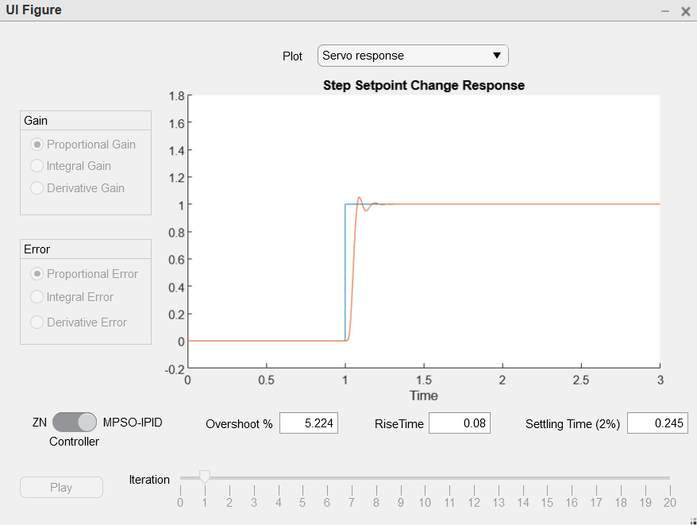
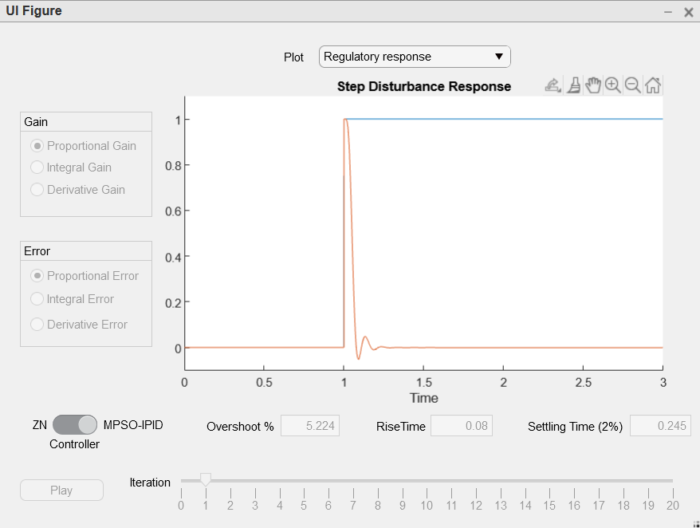

2. Response for every iteration

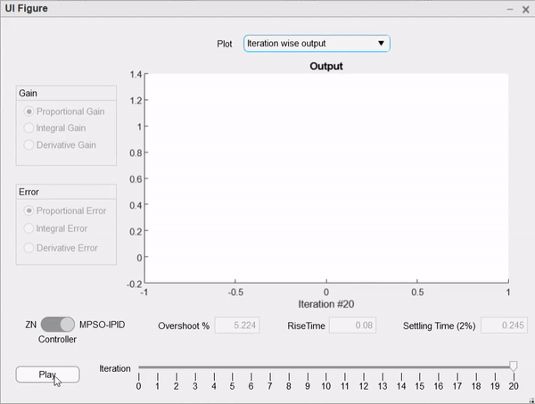

As expected, initially the response is very oscillatory since gains are unoptimized. In subsequent iterations, the response becomes better as the PSO algorithm tunes the parameters to the optimum value

3. Gains

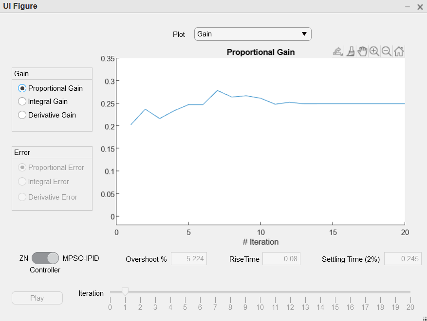
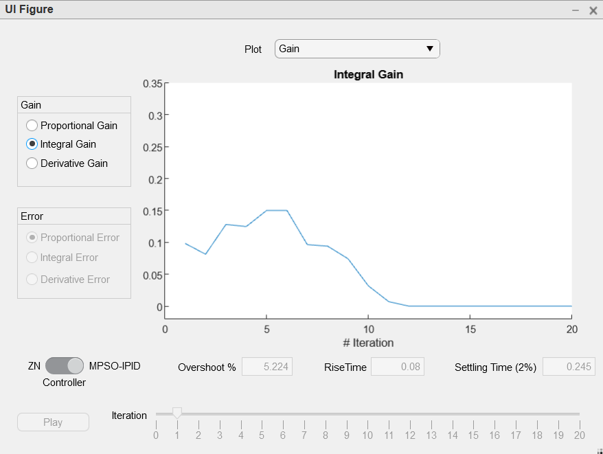
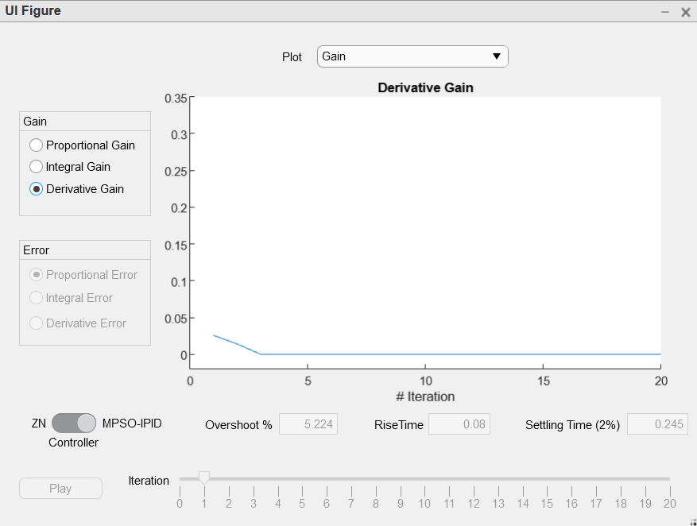

4. Fitness and objective function

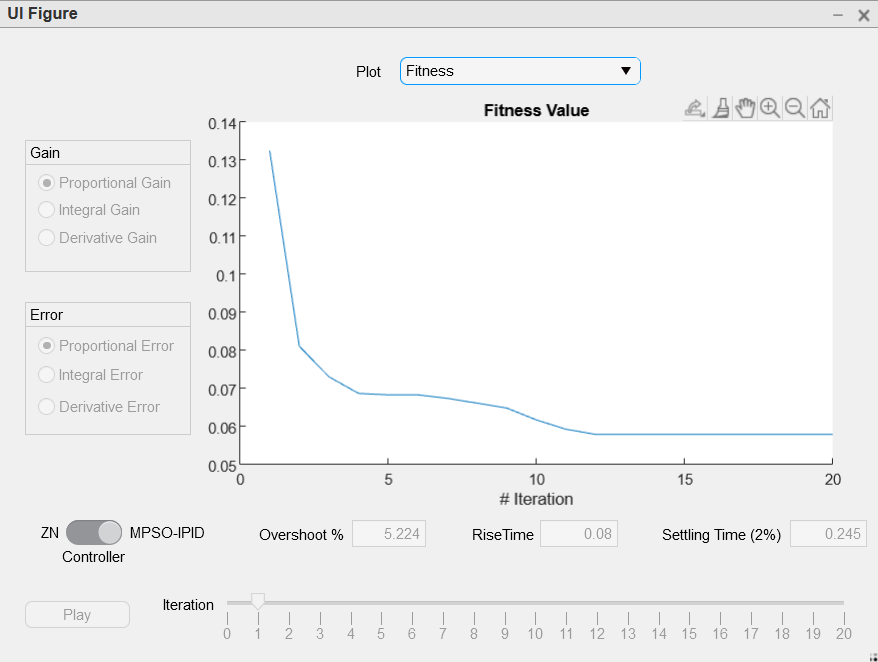
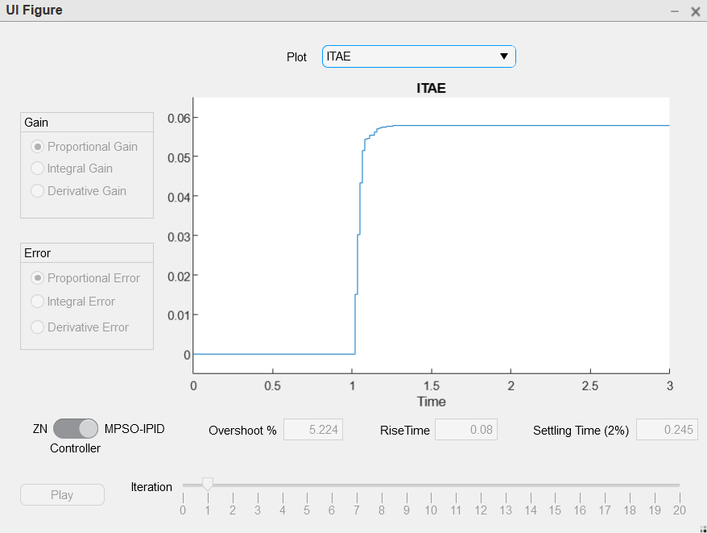

5. Errors

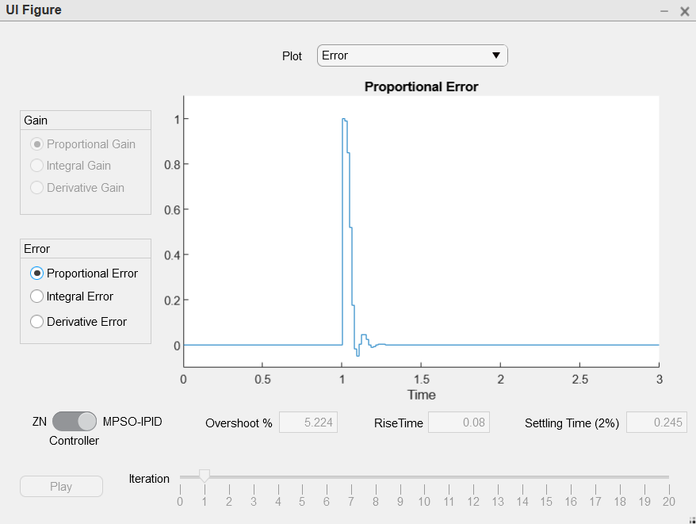
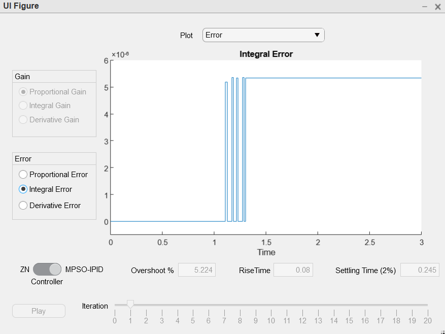
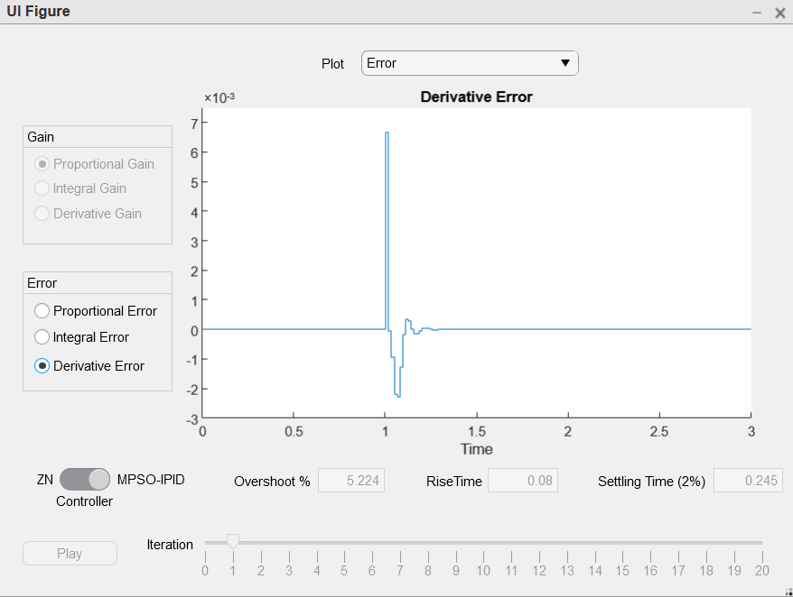

Note that the integral error is forced to become zero whenever proportional error crosses a threshold. This is because of the anti-windup mechanism.

## Comparison with Ziegler-Nichols method

To get the ZN parameters, we must solve the characteristic equation $1 + G_p K_u = 0$. At the critical point, $s = j\omega$. The real and imaginary parts are separated and solved to get $K_u = 0.578, P_u = \cfrac{2\pi}{\omega} = 0.0898$.

$\therefore K_c = \cfrac{K_u}{1.7} = 0.3453, \tau_I = \cfrac{P_u}{2} = 0.0456, \tau_D = \cfrac{P_u}{8} = 0.0114$

We see that the marginally stable response oscillates forever and neither settles to a steady state nor blows up to infinty.

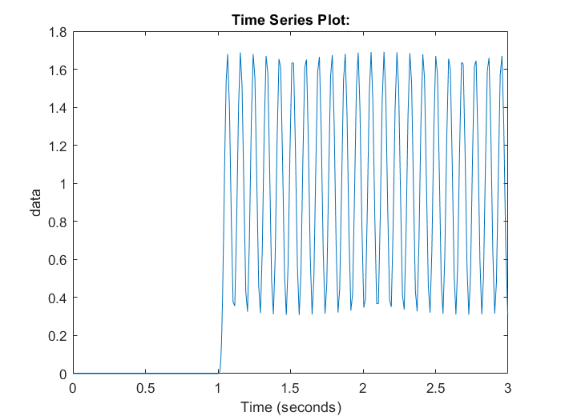

The ZN tuned PID controller has a peak overshoot of 68.41%, settling time (2% tolerance band) of 1.17 seconds and a rise time of 0.047 seconds. These are significantly worse performance metrics than the MPSO-IPID controller, which have these values at 5.224%, 0.245 seconds and 0.08 seconds respectively. Thus, in conclusion, we can use non-deterministic algorithms like PSO to create mre efficient and robust control systems.

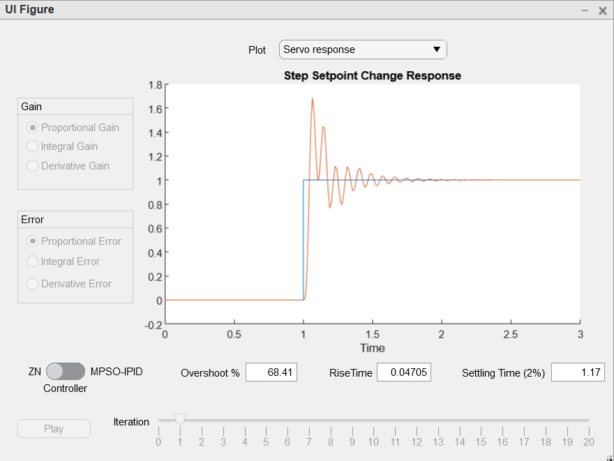
